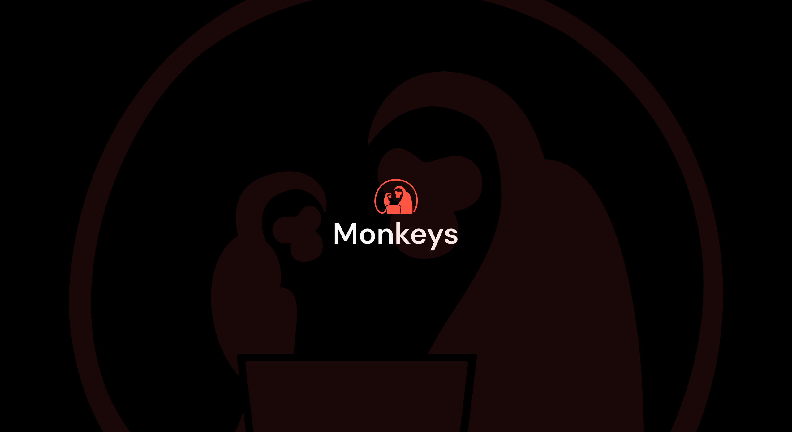

<picture>
  
</picture>

# Monkeys

### Inspire, Inform, Innovate

Monkeys is a community built around **meaningful, accurate, and valuable content**.  
Our mission is to help people access knowledge that enriches their lives—whether in science, technology, personal development, psychology, philosophy, or lifestyle.

Unlike open forums that prioritize volume, we believe in **quality first**. Every perspective shared on Monkeys is meant to inspire growth, challenge thinking, and encourage deeper understanding.

This is not just another content platform. It’s a space where members can trust what they read, knowing it comes from thoughtful, informed contributors.

## Our Community

We value:

-   **Correctness** – Insights grounded in knowledge, not noise.
-   **Clarity** – Content that informs, educates, and engages.
-   **Contribution with Purpose** – Every piece shared should add real value.

We encourage discussion, but always with the goal of **learning and growth**. Together, we’re building a more reliable and insightful community.

## Contributing

We welcome all kinds of contributions—whether they strengthen our technical foundation or enrich our content to help the platform flourish. If you’re passionate about sharing knowledge in a way that truly benefits others, we’d love to hear from you.

Ways you can contribute:

1. **Code Contributions** – Improve platform features, fix issues, or enhance reliability.
2. **Documentation** – Help us keep information clear and up to date.
3. **Content Creation** – Share well-researched, thoughtful articles or tutorials.
4. **Feature Suggestions** – Have an idea that aligns with our vision? Let us know.

All contributions are **reviewed carefully** to ensure they reflect the standards and purpose of Monkeys community.

## Backend

Our platform is powered by a robust backend written in Go, maintained in a dedicated repository.

Backend repo: [Monkeys Backend](https://github.com/the-monkeys/monkeys_engine)

If you’d like to contribute technically, we encourage you to explore the architecture, suggest improvements, or collaborate on features that make Monkeys a stronger, more reliable space.

## 🚀 Quick Start

### Docker Deployment
```bash
# Setup and deploy
cp .env.production.example .env.production
docker-compose up -d
```

### Development
```bash
# Install and run
pnpm run install-deps
pnpm run dev
```
## Guidelines

To keep our community focused and meaningful:

1. **Issues** – Please follow the provided format when raising an issue. This helps us address matters efficiently.
2. **Pull Requests** – PRs should align with our goals of clarity, correctness, and reliability. Use the prescribed format for faster reviews.

By following these, you help us preserve the quality of Monkeys.

## Join Us

Monkeys is a place for those who care about knowledge that **Inspire, Inform, and Innovate**. If you share that vision, we invite you to be part of the journey—whether through contributions, thoughtful feedback, or meaningful discussion.
