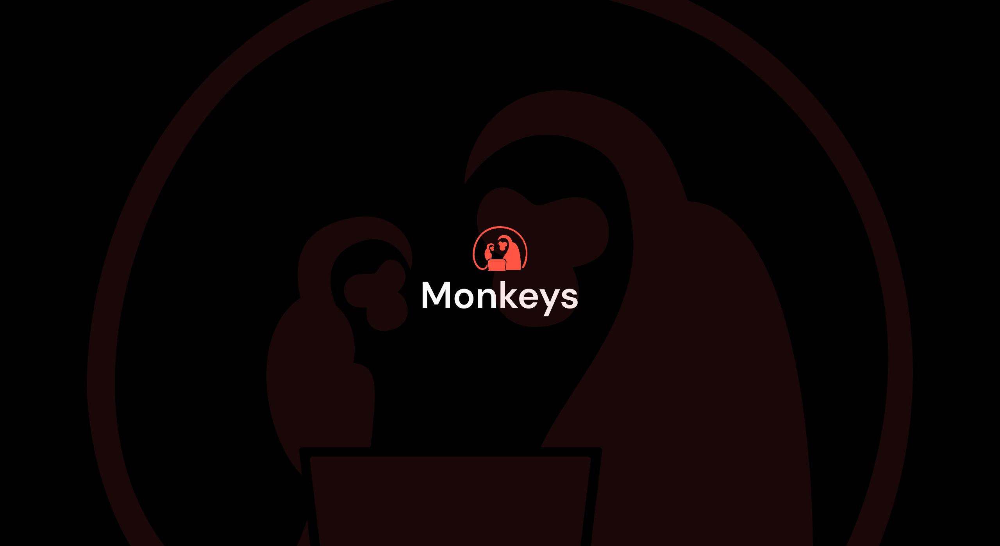

# Monkeys

<picture>
  
</picture>

> Research-first publishing platform: journals, community events, groups, and a social creative studio.

Monkeys is a modern, research-first community platform designed for high-quality technical and scientific writing, community events, collaborative groups, and social graphic creation.

---

## 🏗️ Repository Architecture

This repository is managed as a **Turborepo** monorepo powered by **pnpm workspaces**:

```
the_monkeys/
├── apps/
│   └── the_monkeys/          # Next.js 14 App Router web application
├── packages/
│   ├── ui/                   # Shared UI component library (Radix UI + Tailwind CSS)
│   └── config/               # Shared workspace configurations
├── scripts/                  # Cross-platform utility scripts (host configuration, etc.)
├── docker-compose.yml        # Production Docker Compose definition
├── docker-compose.local.yml  # Local Docker Compose setup (bridges to monkeys_engine network)
└── Dockerfile                # Multi-stage Docker build with runtime environment support
```

### Core Technologies

* **Framework**: [Next.js 14](https://nextjs.org/) (App Router) with [React 18](https://react.dev/)
* **Styling**: [Tailwind CSS](https://tailwindcss.com/) & [Radix UI](https://www.radix-ui.com/)
* **Runtime Config**: [`next-runtime-env`](https://www.npmjs.com/package/next-runtime-env) (build once, deploy anywhere)
* **Data Fetching**: [TanStack Query v5](https://tanstack.com/query)
* **Testing**: [Vitest](https://vitest.dev/) and [@testing-library/react](https://testing-library.com/)
* **Workspace Management**: [Turborepo](https://turbo.build/) with [pnpm](https://pnpm.io/)

---

## ✨ Product Features

* **Research Journals & Feed (`/feed`, `/blog/[slug]`)**: Long-form publishing with rich markdown, code syntax highlighting, and LaTeX math formatting via KaTeX.
* **Events & RSVP (`/events`)**: Discover and organize community meetups, workshops, and scientific talks with integrated RSVP management and calendar integration.
* **Research Groups (`/groups`)**: Topic-based collaborative spaces for community research and discussions.
* **Creative Studio (`/snapshot/new`, `/cards`)**:
  * **Social Image Templates**: Aspect-ratio-adaptive post graphics (Editorial portrait, 1:1 quotes, Instagram carousels, LinkedIn and X shares).
  * **X / Twitter Screenshots**: Stylized tweet renders with custom backgrounds and presets.
  * **Digital Business Cards**: Printable and shareable contact cards (`/cards`).

---

## 🔗 Backend Integration

The backend is built in Go and maintained in a dedicated repository:

* **Repository**: [Monkeys Engine](https://github.com/the-monkeys/monkeys_engine)
* **Communication**: The frontend connects via HTTP REST endpoints and WebSocket channels configured through environment variables.
* **Runtime Variables**: Client-side endpoints are injected at container startup using `next-runtime-env`, eliminating the need to bake endpoints into the build bundle.

---

## 🚀 Quick Start

### Prerequisites

* **Node.js**: `18.17.0` or later (refer to [`.nvmrc`](./.nvmrc))
* **pnpm**: `10.0.0` or later (configured in [`package.json`](./package.json))

> [!TIP]
> If `pnpm` is not installed globally, bootstrap it using `npm run install-deps`.

### 1. Clone & Install Dependencies

```bash
git clone https://github.com/the-monkeys/the_monkeys.git
cd the_monkeys
pnpm install
```

### 2. Configure Environment Variables

Create `.env.local` inside `apps/the_monkeys`:

```bash
cp apps/the_monkeys/.env.example apps/the_monkeys/.env.local
```

Key environment variables:

| Variable | Description |
| :--- | :--- |
| `NEXT_PUBLIC_API_URL` | Base HTTP endpoint for the backend API |
| `NEXT_PUBLIC_API_URL_V2` | V2 backend HTTP endpoint |
| `NEXT_PUBLIC_WSS_URL` | WebSocket endpoint for real-time services |
| `NEXT_PUBLIC_LIVE_URL` | Production/Public application URL |
| `AUTH_SECRET` | Secret key used for session encryption |
| `NEXT_PUBLIC_GROWTHBOOK_CLIENT_KEY` | (Optional) Feature flag client key |

### 3. Local Domain Setup (Recommended)

To allow authentication cookies to share context with a locally running backend:

```bash
make setup-hosts
# or on Linux/macOS:
sudo bash ./scripts/setup-hosts.sh
# or on Windows (PowerShell as Admin):
powershell -ExecutionPolicy Bypass -File "scripts/setup-hosts.ps1"
```

This maps `127.0.0.1 local.monkeys.com.co` in your hosts file.

### 4. Run Development Server

```bash
pnpm dev
```

The application will be accessible at [http://localhost:3000](http://localhost:3000) (or `http://local.monkeys.com.co:3000` if host mapping is configured).

---

## 🐳 Docker Deployment

The application provides multi-stage Docker builds utilizing `next-runtime-env` for runtime environment injection.

```bash
# 1. Create root environment file
cp .env.local.example .env.local

# 2. Run container connecting to the local backend network
docker compose -f docker-compose.local.yml up
```

For production deployment:

```bash
docker compose -f docker-compose.yml up -d
```

---

## 🛠️ Common Commands

All commands can be run from the repository root via Turborepo:

| Command | Description |
| :--- | :--- |
| `pnpm dev` | Start development servers with hot-reload |
| `pnpm build` | Run lint checks and create production build |
| `pnpm test` | Run Vitest unit and component test suites |
| `pnpm lint` | Execute linter across all workspaces |
| `pnpm format` | Automatically format code using Prettier and Biome |

---

## 🤝 Contributing & License

* Contributions are welcome! Read [CONTRIBUTING.md](./CONTRIBUTING.md) for detailed guidelines on setup, branch naming, and pull requests.
* Monkeys is licensed under the [Apache 2.0 License](./LICENSE.md).
