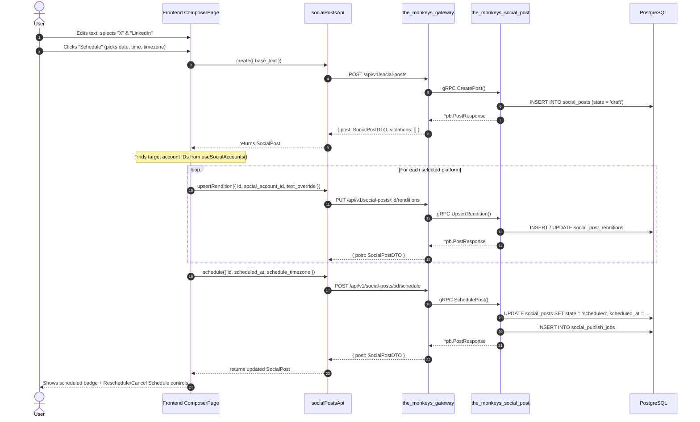

# Studio Phase 1: Core Social Publishing & Gateway Contract Alignment — Design

Date: 2026-09-19  
Surfaces: Studio Composer, Studio Desk, Studio Accounts, Studio Media  
Repos: `monkeys_brain` (backend), `the_monkeys` (frontend)  
Branches: `gautam/studiov2`  

---

## 1. Problem Statement

OpenStudio social post scheduling was introduced across both `monkeys_brain` (backend gRPC microservice + gateway REST routes) and `the_monkeys` (Next.js frontend studio routes). While the core PostgreSQL schema and microservice logic are complete, several contract and client gaps prevent end-to-end publishing:

1. **Gateway Enum & Envelope Mismatches**: The gateway directly serialized raw protobuf messages via Gin `c.JSON(http.StatusOK, resp)`. This caused enum fields (`Platform`) to serialize as raw integers (`1`, `2`, etc.) rather than standard platform strings (`"x"`, `"linkedin"`), and produced nested envelopes (`{ "accounts": [...] }`, `{ "assets": [...] }`, `{ "post": {...}, "violations": [...] }`).
2. **Runtime Exceptions in Accounts & Media**: Calling `.find()` or `.map()` directly on enveloped responses caused client-side TypeErrors in `accounts/page.tsx` and `media/page.tsx`.
3. **Rendition Association Bug**: Newly created posts had empty `result.renditions`, so `ComposerPage.tsx` failed to look up account IDs and skipped saving renditions for selected platforms entirely.
4. **Missing Composer Actions**: The Composer only possessed a "Save draft" button; users could not schedule (date/time/timezone), publish immediately, cancel a schedule, reschedule, or delete drafts.
5. **State/Status Divergence**: Backend DB and proto use `state`, whereas frontend types expect `status`, leaving Studio Desk summary cards reporting 0 drafts/scheduled/published.

---

## 2. Goals & Non-Goals

### Goals
- Normalize REST responses in `the_monkeys_gateway` so all platforms are returned as lowercase strings (`"x"`, `"linkedin"`, `"instagram"`, `"facebook"`, `"youtube"`, `"tiktok"`), and envelopes provide both canonical and backward-compatible fields.
- Align frontend types and API client to unwrap and normalize responses reliably.
- Fix the account-to-rendition lookup bug in Composer so platform renditions are saved for newly created posts.
- Deliver the complete All-in-One action bar in Composer (Save Draft, Schedule with date/time/timezone picker, Publish Now, Cancel Schedule, Reschedule, Delete Draft).
- Sync Studio Desk metrics to correctly count posts by status.
- Add unit tests for gateway serialization and frontend client normalization.

### Non-Goals
- Phase 2 (interactive Queue reordering and month/week Calendar grid views) — covered in subsequent sub-project.
- Phase 3 (Media library upload/Snapshot/Cards import and job failure replay UI) — covered in subsequent sub-project.
- Altering PostgreSQL migrations or core microservice business logic.

---

## 3. Architecture & Data Flow



---

## 4. Detailed Component Design

### 4.1. Gateway REST DTOs (`monkeys_brain`)

File: `microservices/the_monkeys_gateway/internal/social_post/routes.go`

1. **Enum String Translation**:
   ```go
   var platformToString = map[pb.Platform]string{
       pb.Platform_PLATFORM_X:         "x",
       pb.Platform_PLATFORM_LINKEDIN:  "linkedin",
       pb.Platform_PLATFORM_INSTAGRAM: "instagram",
       pb.Platform_PLATFORM_FACEBOOK:  "facebook",
       pb.Platform_PLATFORM_YOUTUBE:   "youtube",
       pb.Platform_PLATFORM_TIKTOK:    "tiktok",
   }
   ```

2. **DTO Types**:
   - `SocialPostDTO`:
     - `ID`: string (`id`)
     - `BaseText`: string (`base_text`)
     - `State`: string (`state`)
     - `Status`: string (`status`) — duplicate of `State` for frontend compatibility
     - `Version`: int64 (`version`)
     - `ScheduledAt`: string (`scheduled_at,omitempty`)
     - `ScheduleTimezone`: string (`schedule_timezone,omitempty`)
     - `QueuePosition`: *int64 (`queue_position,omitempty`)
     - `Renditions`: `[]RenditionDTO` (`renditions`)
     - `CreatedAt`: string (`created_at`)
     - `UpdatedAt`: string (`updated_at`)
   - `RenditionDTO`:
     - `ID`, `SocialAccountID`, `Platform` (string), `TextOverride`, `ScheduledAt`, `ScheduleTimezone`, `State`, `Version`, `Media`, `ProviderPostRef`, `LastErrorCode`, `LastErrorMessage`
   - `SocialAccountDTO`:
     - `ID`, `Platform` (string), `DisplayName`, `Handle`, `Status`, `Validation`
   - `ValidationMetadataDTO`:
     - `Platform` (string), `MaxTextCharacters`, `AllowedMediaKinds`, `MaxMediaCount`, `MaxMediaBytes`, `MaxVideoDurationMs`, `MediaRequired`
   - `MediaAssetDTO`:
     - `ID`, `ObjectKey`, `Checksum`, `ContentType`, `ByteSize`, `MediaKind`, `SourceKind`, `Width`, `Height`, `DurationMs`

3. **Envelope Transformers**:
   - `toPostDTO(pb *pb.SocialPost) *SocialPostDTO`
   - `toPostResponseDTO(resp *pb.PostResponse) gin.H` -> `{"post": toPostDTO(resp.GetPost()), "violations": toViolationsDTO(resp.GetViolations())}`
   - `toListPostsResponseDTO(resp *pb.ListPostsResponse) gin.H` -> `{"items": posts, "posts": posts, "next_page_token": resp.GetNextPageToken()}`
   - `toListAccountsResponseDTO(resp *pb.ListAccountsResponse) gin.H` -> `{"accounts": accounts}`
   - `toListMediaResponseDTO(resp *pb.ListMediaAssetsResponse) gin.H` -> `{"assets": assets, "items": assets, "next_page_token": ...}`

---

### 4.2. Frontend Types & API Client (`the_monkeys`)

Files:
- `apps/the_monkeys/src/features/studio/types.ts`
- `apps/the_monkeys/src/services/socialPosts/socialPostsApi.ts`
- `apps/the_monkeys/src/hooks/studio/useSocialPosts.ts`

1. **`types.ts`**:
   - Add `state: SocialPostStatus` and `status: SocialPostStatus` to `SocialPost`.
   - Add `FieldViolation` and `ValidationMetadata` definitions.
   - Update `SocialAccount` with optional `validation?: ValidationMetadata`.

2. **`socialPostsApi.ts`**:
   - `create(input)`: unwraps `data.post ?? data`.
   - `update(id, input, expectedVersion)`: unwraps `data.post ?? data`.
   - `get(id)`: unwraps `data.post ?? data`.
   - `upsertRendition(...)`: unwraps `data.post ?? data`.
   - `schedule(...)`: unwraps `data.post ?? data`.
   - `publishNow(...)`: unwraps `data.post ?? data`.
   - `delete(id, expectedVersion)`: calls `axiosInstance.delete` with `expected_version`.
   - `cancelSchedule(id, expectedVersion)`: calls `axiosInstance.delete` with `expected_version`.
   - `accounts()`: unwraps `data.accounts ?? data`.
   - `media()`: unwraps `data.assets ?? data.items ?? data`.

3. **`useSocialPosts.ts`**:
   - Add `deleteDraft` mutation in `useSocialPostMutations()`.
   - Add `useValidationMetadata()` hook.

---

### 4.3. Composer UI & Publishing Flow (`the_monkeys`)

File: `apps/the_monkeys/src/features/studio/composer/ComposerPage.tsx`

1. **Account Lookup**:
   - Call `useSocialAccounts()`.
   - When iterating over `selected` platforms in `save()`, match `platform` to `accounts.find((a) => a.platform === platform)?.id`.
   - If found, invoke `upsertRendition` with that `social_account_id`.

2. **Action Bar Layout**:
   - Sticky or bottom container with actions:
     - **Draft Mode**:
       - Primary: `Save draft` (button).
       - Secondary: `Publish now` (button).
       - Secondary: `Schedule...` (toggles inline schedule drawer).
       - Destructive: `Delete draft` (button, if post already exists).
     - **Scheduled Mode**:
       - Status badge showing: `Scheduled for [Localized Date/Time] ([Timezone])`.
       - `Reschedule` (opens date/time picker).
       - `Cancel schedule` (calls `cancelSchedule`, returns post to draft).
       - `Publish now` (immediate publication override).
     - **Publishing / Published Mode**:
       - Status badge indicating progress or success.

3. **Inline Schedule Drawer**:
   - Inputs:
     - Date: HTML5 `<input type="date" min={today} />`.
     - Time: HTML5 `<input type="time" />`.
     - Timezone: `<select>` populated with user local timezone as default, plus major timezones (UTC, America/New_York, Europe/London, Asia/Kolkata, Asia/Tokyo, etc.).
   - Actions:
     - `Confirm schedule`: Validates `scheduled_at > new Date()`, saves post draft first, calls `schedule.mutateAsync()`, closes drawer.
     - `Cancel`: Closes drawer.

4. **Character Limits & Warnings**:
   - Real-time character count displayed next to each selected platform.
   - Turns red if `text.length > limit`.
   - Disables `Publish now` and `Schedule` if text exceeds limit.

---

### 4.4. Studio Desk Metric Sync (`the_monkeys`)

File: `apps/the_monkeys/src/app/studio/page.tsx`
- Counts posts using `post.state || post.status`:
  - Drafts: `post.state === 'draft' || post.status === 'draft'`
  - Scheduled: `post.state === 'scheduled' || post.status === 'scheduled'`
  - Published: `post.state === 'published' || post.status === 'published'`

---

## 5. Verification Plan

### Automated Tests
1. **Backend (`monkeys_brain`)**:
   - Command: `go test -v ./microservices/the_monkeys_gateway/internal/social_post/...`
   - Checks: Platform strings `"x"`, `"linkedin"` serialized in REST JSON responses; status codes and envelope formatting.
2. **Frontend (`the_monkeys`)**:
   - Command: `npm test` in `apps/the_monkeys`
   - Add unit test: `apps/the_monkeys/src/services/socialPosts/socialPostsApi.test.ts` verifying API client normalizes `{ post }`, `{ accounts }`, and `{ assets }` correctly.

### Manual / Responsive Verification
- Verify Composer UI:
  - Create new post, select X and LinkedIn, save draft -> check renditions persisted.
  - Test schedule flow with date/time/timezone picker.
  - Test cancel schedule -> reverts to draft.
  - Test publish now -> transitions to publishing.
  - Test character counter exceeding limit -> disables action buttons.
