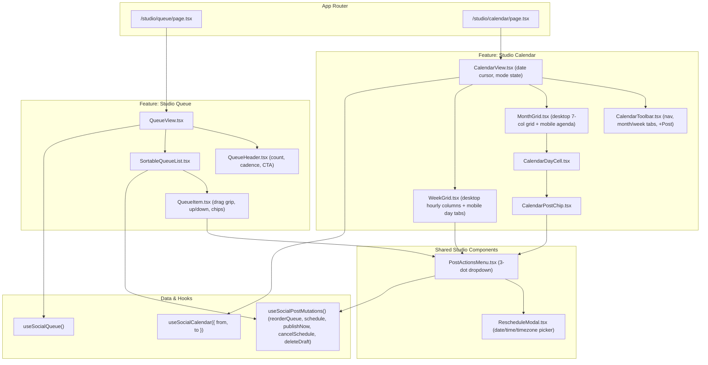

# Studio Phase 2: Interactive Queue Reordering & Calendar Surfaces — Design

Date: 2026-09-19  
Surfaces: Studio Calendar (`/studio/calendar`), Studio Queue (`/studio/queue`), Shared Post Actions  
Repos: `the_monkeys` (frontend), `monkeys_brain` (backend)  
Branches: `gautam/studiov2`  

---

## 1. Problem Statement

In Phase 1, the core social publishing engine, gateway REST DTO normalization, and Composer scheduling actions were completed and verified. However, the secondary planning surfaces remain placeholders:

1. **Queue Surface (`/studio/queue`)**:
   - Currently uses a static, non-interactive `StudioCollectionPage kind="queue"` placeholder list.
   - Users cannot reorder queued posts, adjust execution order, or see queue positioning `#1, #2, ...`.
   - While the backend provides `PUT /api/v1/social-posts/queue/order` and `GET /api/v1/social-posts/queue`, the UI lacks drag-and-drop, accessible reorder buttons, optimistic reordering, and rich post previews.
2. **Calendar Surface (`/studio/calendar`)**:
   - Currently uses a static `StudioCollectionPage kind="calendar"` placeholder list.
   - Lacks an interactive visual calendar (Month grid and Week timeline grid).
   - Users cannot see publishing cadence at a glance, click days to schedule posts, or view post chips by time and platform.
3. **Mobile & Touch UX**:
   - Complex 7-column calendar grids and drag-and-drop interfaces often break on mobile screens if not deliberately adapted.
   - Needs a mobile-responsive solution inspired by production platforms like Postiz (compact date picker + touch-friendly day agenda list on mobile; accessible up/down controls on queue cards).

---

## 2. Goals & Non-Goals

### Goals
- **Calendar Surface**:
  - Implement full **Month View** (7x5/7x6 day grid with post chips, platform icons, day "+ New" trigger, dimmed other-month days, and "+N more" expansion).
  - Implement full **Week View** (7-day columns with time buckets, scheduled post cards, current time indicator line, and click-to-schedule hourly slots).
  - Provide a **Calendar Toolbar** with Month/Week segmented toggle, `‹ Prev`, `Today`, `Next ›` navigation, active month/week label, and "+ New Post" button.
  - Deliver a **Mobile Responsive UX**: On screens `< 768px`, Month view displays a swipeable/compact date selector matrix on top with a fluid touch-friendly **Day Agenda** list below; Week view provides a day-tab switcher.
- **Queue Surface**:
  - Implement **Interactive Queue Reordering** with both smooth drag handles (pointer and touch friendly) and accessible `▲ Up` / `▼ Down` buttons.
  - Implement **Optimistic Reorder Updates** via `useSocialPostMutations().reorderQueue` (`PUT /queue/order`) with immediate UI repositioning and graceful error rollback with toast notification.
  - Rich queue cards displaying queue sequence `#N`, scheduled time pill, platform badges, text preview, media thumbnail, and 3-dot dropdown.
- **Shared Post Actions Menu**:
  - Unify quick actions across Calendar chips and Queue cards via `PostActionsMenu`:
    - Edit in Composer (`/studio/compose/[id]`)
    - Publish Now (direct mutation)
    - Reschedule (inline date/time/timezone selection modal)
    - Cancel Schedule (reverts to draft)
    - Delete Draft
- **Testing**:
  - Unit tests for all new components (`CalendarView`, `MonthGrid`, `WeekGrid`, `CalendarToolbar`, `QueueView`, `QueueItem`, `PostActionsMenu`).
  - Maintain 100% pass rate across existing 220 tests and backend gateway tests.

### Non-Goals
- Phase 3 (Media upload modal from Snapshot / Cards, job replay audit UI) — reserved for Phase 3.
- Modifying backend database schemas or gRPC proto definitions (backend `/queue`, `/queue/order`, and `/calendar` routes are already operational).

---

## 3. Architecture & Component Hierarchy



---

## 4. Calendar Surface Specification

### 4.1 State Management & Date Windowing (`CalendarView.tsx`)
- **Current Cursor**: `currentDate: Date` (defaults to `new Date()`).
- **View Mode**: `viewMode: 'month' | 'week'` (defaults to `'month'`).
- **Date Calculation via `date-fns`**:
  - In `'month'` mode:
    - Interval start: `startOfWeek(startOfMonth(currentDate), { weekStartsOn: 1 })` (Monday start).
    - Interval end: `endOfWeek(endOfMonth(currentDate), { weekStartsOn: 1 })`.
  - In `'week'` mode:
    - Interval start: `startOfWeek(currentDate, { weekStartsOn: 1 })`.
    - Interval end: `endOfWeek(currentDate, { weekStartsOn: 1 })`.
- **Query Wiring**:
  ```ts
  const { data, isLoading, isError } = useSocialCalendar({
    from: intervalStart.toISOString(),
    to: intervalEnd.toISOString(),
    page_size: 100,
  });
  const posts = data?.items ?? [];
  ```

### 4.2 Toolbar (`CalendarToolbar.tsx`)
- **Navigation Buttons**:
  - `‹` (Previous interval: `subMonths(currentDate, 1)` or `subWeeks(currentDate, 1)`).
  - `Today` (resets cursor to `new Date()`).
  - `›` (Next interval: `addMonths(currentDate, 1)` or `addWeeks(currentDate, 1)`).
- **Interval Title**:
  - Month mode: `format(currentDate, 'MMMM yyyy')` (e.g. "September 2026").
  - Week mode: `format(startOfWeek, 'MMM d') + ' – ' + format(endOfWeek, 'MMM d, yyyy')`.
- **View Mode Segmented Control**:
  - Two buttons: `Month` and `Week`, with active background pill.
- **CTA**:
  - `+ New Post` button linking to `/studio/compose`.

### 4.3 Month Grid (`MonthGrid.tsx`)
- **Desktop Grid (>= 768px)**:
  - 7 column header: `Mon`, `Tue`, `Wed`, `Thu`, `Fri`, `Sat`, `Sun`.
  - Days array: `eachDayOfInterval({ start: intervalStart, end: intervalEnd })` (42 or 35 cells).
  - Day Cell (`CalendarDayCell.tsx`):
    - Background: `bg-background-light dark:bg-background-dark`, border `border-border`.
    - Dimmed styling if `!isSameMonth(day, currentDate)` (`opacity-40`).
    - Today styling: bold date number with `bg-brand-orange text-white rounded-full` or orange ring if `isToday(day)`.
    - On hover: reveals a small `+` icon button in the header to create a post for that day (`/studio/compose?date=YYYY-MM-DD`).
    - Posts matching day (`isSameDay(parseISO(post.scheduled_at), day)`):
      - Render up to 3 `CalendarPostChip` components.
      - If > 3 posts, renders `+N more` pill that expands or reveals popover.
- **Mobile Agenda Mode (< 768px)**:
  - Top: Compact mini-calendar week/month selector matrix. Days with scheduled posts display a small dot indicator below the date number.
  - Selected Day state (`selectedDay: Date`, defaults to today).
  - Bottom: Fluid **Day Agenda List** showing:
    - Day header: `"Saturday, Sep 19, 2026 — 2 posts"`.
    - Full post cards with thumbnail preview, platform badges, scheduled time, and `PostActionsMenu`.
    - Empty state: `"No posts scheduled for this day"` with `+ Schedule on this day` button.

### 4.4 Week Grid (`WeekGrid.tsx`)
- **Desktop Grid (>= 768px)**:
  - Left column: 24 hour slots (12 AM, 1 AM, ..., 11 PM or localized 24h).
  - 7 day columns: sticky header showing weekday and date.
  - Red/orange horizontal rule across today's column marking the live current minute (`now.getHours() * 60 + now.getMinutes()`).
  - Hourly slots: clickable cells with hover border; clicking an hourly slot opens `/studio/compose` prefilled with that date & hour.
  - Posts positioned in their scheduled hour cell with platform pills, snippet, and actions.
- **Mobile Grid (< 768px)**:
  - Horizontal tab bar for the 7 days of the active week.
  - Selected day displays that day's vertical 24-hour timeline without horizontal squeezing.

---

## 5. Queue Surface Specification

### 5.1 Queue View Layout (`QueueView.tsx`)
- **Header**:
  - Title: `"Publishing Queue"`.
  - Description: `"Organize and reorder your upcoming scheduled dispatches."`.
  - Badges: `"X posts scheduled"`.
  - CTA: `+ Add to Queue` button linking to `/studio/compose`.
- **Query Wiring**:
  ```ts
  const { data, isLoading, isError } = useSocialQueue(100);
  const posts = data?.items ?? [];
  ```

### 5.2 Interactive Reordering (`SortableQueueList.tsx` & `QueueItem.tsx`)
- **Local Optimistic State**:
  - Local state `items: SocialPost[]` initialized from query data and updated during drag/click.
  - Function `handleMove(fromIndex: number, toIndex: number)`:
    ```ts
    const newItems = arrayMove(items, fromIndex, toIndex);
    setItems(newItems);
    const postIds = newItems.map(p => p.id);
    try {
      await reorderQueue.mutateAsync(postIds);
    } catch (err) {
      setItems(items); // Rollback
      toast.error('Failed to update queue order. Reverted.');
    }
    ```
- **Queue Item Visual Components**:
  - **Drag Handle**: 6-dot grab icon `⠿` with `cursor-grab active:cursor-grabbing` and `touch-action: none`.
  - **Position Pill**: `#1`, `#2`, `#3`... styled in brand typography.
  - **Accessible Buttons**:
    - `▲ Move Up` button (disabled if index === 0).
    - `▼ Move Down` button (disabled if index === items.length - 1).
    - Keyboard navigation: Enter/Space to activate, Arrow keys to shift position.
  - **Post Summary**:
    - Truncated text snippet (up to 2 lines).
    - Media thumbnail preview if attachments exist.
    - Platform badges: Icons for each targeted platform (`x`, `linkedin`, `instagram`, etc.).
    - Formatted scheduled time: `new Date(post.scheduled_at).toLocaleString(...)` with timezone badge.
  - **Actions Menu Trigger**: 3-dot vertical button triggering `PostActionsMenu`.

---

## 6. Shared Post Actions (`PostActionsMenu.tsx`)

A unified dropdown menu component used across both Calendar chips and Queue cards.

### Actions
1. **Edit in Composer**:
   - Link: `/studio/compose/${post.id}`.
2. **Publish Now**:
   - Calls `publishNow.mutateAsync({ id: post.id, expectedVersion: post.version })`.
   - On success: invalidates `queue`, `calendar`, and `posts` queries, displays success toast.
3. **Reschedule**:
   - Opens `RescheduleModal` with current post date/time pre-filled.
   - User chooses new future date, time, and timezone.
   - Calls `schedule.mutateAsync({ id: post.id, input: { scheduled_at: newIso, schedule_timezone: tz }, reschedule: true })`.
4. **Cancel Schedule**:
   - Calls `cancelSchedule.mutateAsync({ id: post.id, expectedVersion: post.version })`.
   - Post returns to draft state and leaves queue/calendar.
5. **Delete Draft / Post**:
   - Confirms with user, then calls `deleteDraft.mutateAsync({ id: post.id, expectedVersion: post.version })`.

---

## 7. Error Handling & Edge Cases

| Scenario | Behavior |
| :--- | :--- |
| **Network Error during Reorder** | Optimistic array rolls back to previous state; error toast informs user. |
| **Concurrent Edit (HTTP 409)** | Refetches query data; displays banner: *"This post was modified in another session. Refreshed."* |
| **Empty Queue** | Clean empty state with calendar icon and `Create your first queued post` CTA. |
| **No Posts in Month** | Empty calendar cells render with hover `+` button to encourage scheduling. |
| **Day with > 3 Posts (Month View)** | Displays first 3 chips + `+N more` pill that expands day drawer or reveals popover. |
| **Timezones** | All formatting uses post's `schedule_timezone` or browser local timezone fallback. |

---

## 8. Verification & Testing Plan

### Automated Unit Tests (`vitest` in `apps/the_monkeys`)
1. **`CalendarView.test.tsx`**:
   - Verifies Month and Week view switching.
   - Verifies navigation buttons (`‹ Prev`, `Next ›`, `Today`) calculate correct ISO ranges and invoke `useSocialCalendar`.
2. **`MonthGrid.test.tsx`**:
   - Verifies 35/42 day cell rendering.
   - Verifies post chips appear on matching days.
   - Verifies mobile agenda mode (< 768px): tapping a day updates the day agenda list below.
3. **`WeekGrid.test.tsx`**:
   - Verifies 7 day columns and hourly slot rendering.
   - Verifies clicking hourly slot triggers compose navigation with prefilled timestamp.
   - Verifies mobile day-tab switcher.
4. **`QueueView.test.tsx`**:
   - Verifies queue list rendering in position order.
   - Verifies Up and Down buttons reposition items and call `reorderQueue.mutateAsync`.
   - Verifies optimistic rollback on mutation failure.
5. **`PostActionsMenu.test.tsx`**:
   - Verifies dropdown menu opens and executes Publish Now, Cancel Schedule, Reschedule, and Delete mutations.

### Regression & Lint
- Run full frontend suite: `npm test` in `apps/the_monkeys` (all 220+ tests passing).
- Run lint: `npm run lint` in `apps/the_monkeys` (0 errors, 0 warnings).
- Run backend tests: `go test -v ./...` in `monkeys_brain` to verify contract integrity.
